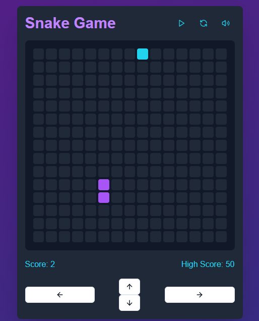

# Snake Game 🐍

A classic Snake Game built with modern web technologies! Control the snake, eat food, and grow longer without hitting the walls or running into your own tail. Level up and increase your speed as you score points!

## Table of Contents
- [Snake Game 🐍](#snake-game-)
  - [Table of Contents](#table-of-contents)
  - [Features](#features)
  - [Demo](#demo)
  - [Installation](#installation)
  - [How to Play](#how-to-play)
  - [Configuration](#configuration)
  - [Technologies Used](#technologies-used)

## Features

- **Smooth Movement**: Snake moves with responsive controls.
- **Game Over Detection**: Game ends if the snake collides with itself.
- **Level Up**: Speed gradually increases as you level up after every 5 points.
- **Confetti & Sounds**: Celebratory sounds and visual effects on level up.
- **High Score Tracking**: Tracks your highest score for each session.
- **Customizable Grid Size**: Adjust the grid size easily in the configuration.

## Demo

Check out a live version of the game [here](https://snake-game-app-eosin.vercel.app/).



## Installation

1. **Clone the repository**:

   ```bash
   git clone https://github.com/Sheikh-Muhammad-Mujtaba/snake_game-app.git
   cd snake-game
   ```

2. **Install dependencies**:

   ```bash
   npm install
   ```

3. **Run the development server**:

   ```bash
   npm start
   ```

   The game should now be running on [http://localhost:3000](http://localhost:3000).

## How to Play

- Use the **arrow keys** (or **WASD** keys) to control the snake.
- **Eat food** to grow longer and gain points.
- Avoid running into Snake **Body** to stay alive.
- Watch out! Every 5 points, the speed increases gradually by 5, making it more challenging.

## Configuration

You can configure various aspects of the game in the code:

- **Grid Size**: `GRID_SIZE` determines the dimensions of the game grid.
- **Speed**: Adjust the initial speed and speed increment.
- **Score Threshold**: Customize the points required to level up.
  
These options are located in the within `moveSnake` function.

## Technologies Used

- **React**: Core framework used to build the game interface.
- **TypeScript**: Adds type safety for a more robust codebase.
- **CSS Modules / Styled Components**: Used for styling the game.
- **Sound Effects & Animations**: For a dynamic gameplay experience.

